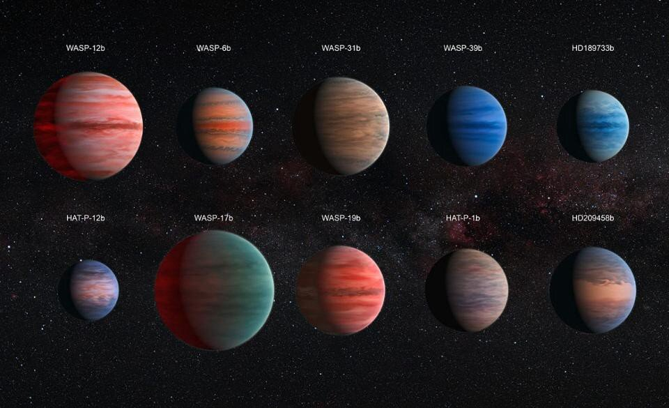
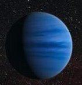
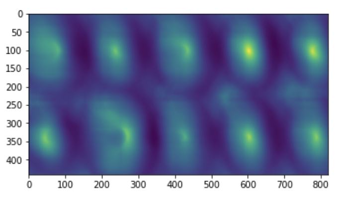
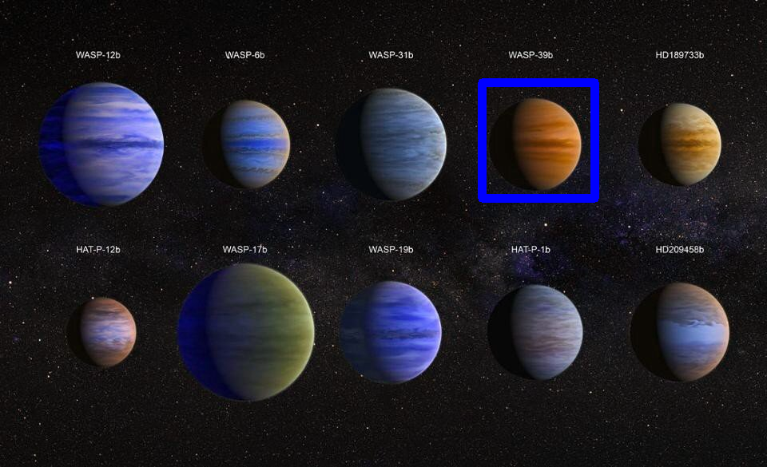

# Template_Matching-

Using Template Matching able to find the part of or specific feature in image and also we can create object detection annotations using template-matching 

## Input Image

Input image showing different type of planets along with names,We need to find planet with name "WASP-39b" in given image 

 

### Feature Template "WASP-39b"  :

 

### Feature correlations 

In This image "WASP-39b" template matched with input image planets is  showing highest  brightness spot that means that spot has highest matching or correlation  

## Output:

planet "WASP-39b"  is found in the input image with bounding box which is shown in blue colour bounding box

